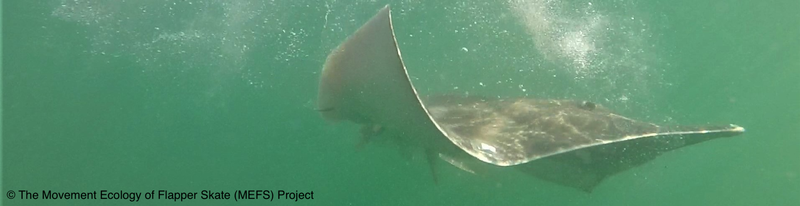
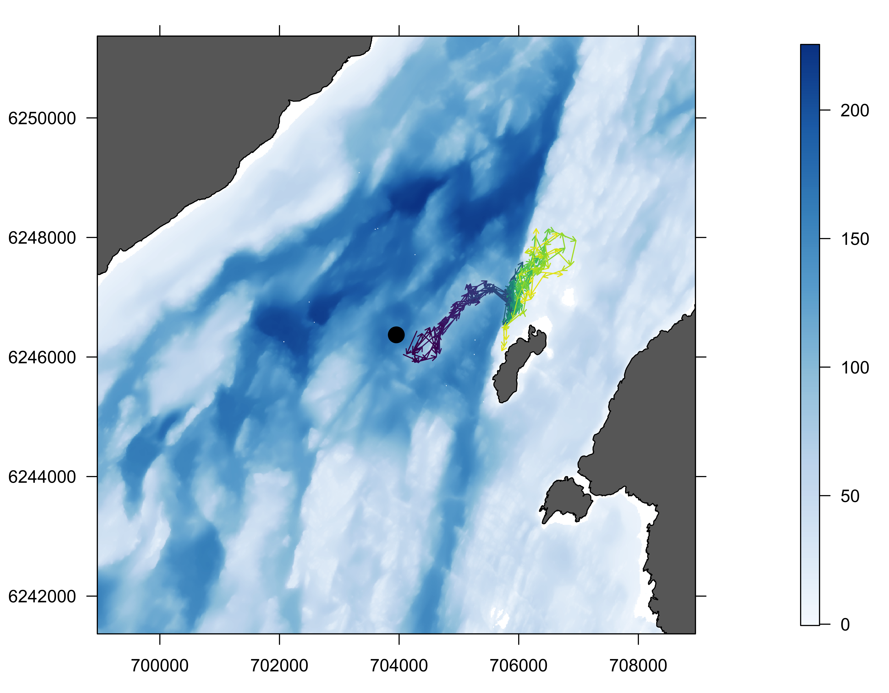

<!-- README.md is generated from README.Rmd. Please edit that file -->

```{r, include = FALSE}
knitr::opts_chunk$set(
  collapse = TRUE,
  comment = "#>"
)
```

^1^ Scottish Oceans Institute, University of St Andrews, Scotland  
^2^ Centre for Research into Ecological and Environmental Modelling, University of St Andrews, Scotland

^\*^ This repository is maintained by Edward Lavender (el72@st-andrews.ac.uk).

[](https://www.repostatus.org/#active)

## Introduction

The `flapper` family of algorithms is a suite of mechanistic approaches designed to reconstruct fine-scale movement paths and emergent patterns of space use from discrete detections in passive acoustic telemetry arrays. This repository illustrates applications of these algorithms to real-world movement (acoustic and archival) data collected from flapper skate (_Dipturus intermedius_) tagged in the Loch Sunart to the Sound of Jura Marine Protected Area (West Scotland) by the Movement Ecology of Flapper Skate (MEFS) project in 2016--17. Four analyses are implemented: 

* **A1: Depth use.** The depth-contour (DC) algorithm is used to examine the depth use of a selected individual over a one-month period in the MPA. 
* **A2: Space use.** The mean-position, acoustic-centroid particle filtering (ACPF) and acoustic-centroid depth-contour particle filtering (ACDCPF) algorithms are used to reconstruct patterns of space use for a selected individual over a one-month period in the MPA. 
* **A3: Post-release paths.** The depth-contour particle filtering (DCPF) algorithm is used to reconstruct fine-scale post-release movement paths of two individuals suggested to exhibit irregular post-release behaviour following catch-and-release angling in the MPA. 
* **A4: Coocccurrences.** The ACDCPF algorithm is used to reconstruct fine-scale movement paths of two individuals during a period of cooccurring detections to examine evidence for close-knit interactions versus fine-scale spatial partitioning. 



_Figure 1. A flapper skate (_Dipturus intermedius_). Photograph courtesy of the Movement Ecology of Flapper Skate project._

## Prerequisites

The analyses are written in `R` and organised as an `R Project`. For data processing and analysis, the [`flapper`](https://github.com/edwardlavender/flapper) `R` package is required. For visualisation, [`prettyGraphics`](https://github.com/edwardlavender/prettyGraphics) is used, which is a dependency in [`flapper`](https://github.com/edwardlavender/flapper). For quick data summaries, the [`utils.add`](https://github.com/edwardlavender/utils.add) package is used on a few occasions.

## Structure
    
1. `data-raw/` contains raw data for the project. 

    * `movement/` contains raw movement data from the MEFS project:
        * `skateids.rds` is a dataframe that records tagged individuals and their characteristics;
        * `moorings.rds` is a dataframe that records acoustic receiver deployments;
        * `acoustics.rds` is a dataframe that records acoustic detections;  
        * `archival.rds` is a dataframe that records depth observations; 
        * `dat_iprb.rds` is a dataframe that records depth observations around catch-and-release angling events;
         
    * `spatial/` contains spatial data for the study area:
        * `bathy/` contains a 5 x 5 m bathymetry raster (named `bathy_res_full_ext_full_abs.tif`), sourced from Howe et al. (2015); 
        * `coastline/` contains a 1:10,000 coastline layer (named `westminster_const_region.shp`) from [Digimap](https://digimap.edina.ac.uk); 
        * `sediments/` contains a map of sediment types (named `HI1354_Sediment_Map_v2_WGS84.shp`), sourced from Howe et al. (2015) and Boswarva et al. (2018); 
    
    * `process_data_raw.R` processes raw data as required for each analysis. 

2. `data/` contains data for the project.  
    * `movement/`contains processed movement time series (from `process_data_raw.R`) and analysis-specific algorithm outputs; 
    * `spatial/` contains processed spatial data (from `process_data_raw.R`);
    * `tmp/` stores temporary files;

3. `R/` contains `R` scripts that implement analyses.  

    * `define_global_param.R` defines global parameters, such as projections, detection and movement parameters; 
    * `define_study_area_fields.R` defines spatial fields for mapping the study area; 
    * `examine_depth_use.R` implements A1; 
    * `examine_space_use.R` implements A2, supported by `examine_space_use_time_trials.R`, `examine_lcps.R` and `examine_habitat_preferences.R`;
    * `examine_post_release_paths.R` implements A3;
    * `examine_coocccurrences.R` implements A4;
   
4. `fig/` contains figures. 

Note that `data-raw/`, `data/` and `fig/` are not included in the online version of this repository. 

## Workflow 

1. **Set up.** Install project dependences (such as [`flapper`](https://github.com/edwardlavender/flapper)) and set up the `R Project`, including the directory system (as outlined above and in the `R` scripts). It is desirable to initiate the project on a system with a capacity of at least 4 TB (e.g., an external hard drive) as some routines generate large numbers of files. Obtain and process the raw data (via `process_data_raw.R`).

2. **Define global parameters.** Define global parameters via `define_global_param.R` and study area fields via `define_study_area_fields.R`. 

3. **Implement algorithms.** Implement A1--4 via `examine_depth_use.R`, `examine_space_use.R` (together with `examine_space_use_time_trials.R`, `examine_lcps.R` and `examine_habitat_preferences.R`), `examine_post_release_paths.R` and `examine_cooccurrences.R` respectively. 

4. **Examine results.** Examine reconstructed patterns of depth and space use and their implications in analyses of habitat preferences; post-release movement paths and fine-scale spatial partitioning during periods of cooccurring detections for the selected individuals. 



_Figure 1. Example outputs of the `flapper_appl` project showing reconstructed movement paths from a selected flapper skate following catch-and-release angling in the Loch Sunart to the Sound of Jura Marine Protected Area. The background shows landmasses (in grey) and the bathymetry (m) (in blue), the individual's release location (in black) and selected paths over an 80-minute period (purple--yellow)._

## References

Boswarva et al. (2018). Improving marine habitat mapping using high-resolution acoustic data; a predictive habitat map for the Firth of Lorn, Scotland. Continental Shelf Research, 168, 39--47. https://doi.org/10.1016/j.csr.2018.09.005

Howe et al. (2015). The seabed geomorphology and geological structure of the Firth of Lorn, western Scotland, UK, as revealed by multibeam echo-sounder survey. Earth and Environmental Science Transactions of the Royal Society of Edinburgh, 105(4), 273--284. https://doi.org/10.1017/S1755691015000146

## Citation

Lavender et al. (in prep). A semi-stochastic modelling framework for passive acoustic telemetry. 
